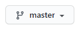
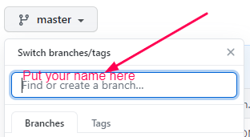
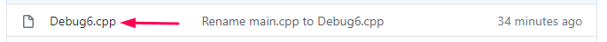

## Debug Challenge #6

Open the file Debug6.cpp and fix the code. It's not working properly. 
It's supposed to sort the defined array into ascending order (smallest to largest).

1. Make a new Branch from the Main with your name.
    1. Click Here  
    
    1. Type your name and hit enter to make a new branch  
    
1. Correct the code.
    1. Click on the Debug6.cpp file
    
1. Commit the changes to your branch with an explanation of what was changed.
